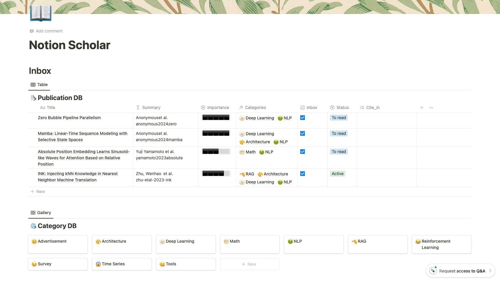

# Bib2NotionDB

NotionとPythonを用いた文献管理ツール．

BibtexファイルかBibtex文を用いてNotion Databaseに文献情報を追加します．
カテゴリごとに分類したり，ステータスごとに分類したりすることによって，文献管理を可能にします．
また，論文用の参考文献のBibtexファイルを出力することもできます．



## インストール
以下のコマンドを実行することで`bib2notiondb`か`bn`でbib2notionDBが利用可能になります．

```
pip install git+https://github.com/kodakoda-koda/Bib2NotionDB#egg=bib2notiondb
```

<details><summary>Pythonとpipを利用したことがない場合</summary>

1. Python 3.7以上をインストール．
2. [pip](https://pip.pypa.io/en/stable/installation/)をインストール．
3. 上のコマンドを実行してbib2notionDBをインストール．

</details>

## 設定

### 1. Notion Databaseを作成

以下のテンプレートを複製し，Notion Databaseを作成．

**テンプレート**

[Link to the template](https://hungry-tungsten-787.notion.site/Notion-Scholar-Template-ecfec86a175240fda7b90ce54ca2db2e?pvs=4)

### 2. integrationを作成
Notion Databaseとの接続を可能にするために，[Notion integration](https://www.notion.so/my-integrations)を作成する．

integrationの設定において，以下の項目にチェックを入れてください:
- [x] Internal Integration
- [x] Read content
- [x] Update content
- [x] Insert content

### 3. integrationのDatabaseへのアクセスを有効にする

1. Databaseを含むページを開く
2. 右上の`...`を開く
3. `+ コネクションを追加`
4. [step2](#2-integrationを作成)で作成したintegrationを追加する

### 4. Set the token and database_id in notion-scholar
コマンドラインを開いて，bib2notionbdのconfigを編集するために，以下のコマンドを実行する．
```
bn set-config --token <token> --database-id <database_id>
```
か
```
bn set-config -t <token> -db <database_id>
```
ここで，<database_id>とは，データベースを開いたときのURLの一部です:
`https://www.notion.so/<workspace_name>/<database_id>?v=<view_id>`

また，tokenとは，notion integrationの`Internal Integration Secret`です．

## 使い方

### 文献情報の追加

1. ローカルにあるBibtexファイルのpath `bib-file-path` を用いて文献情報を追加する:
```
bn run -f <bib-file-path>
```
2. Bibtex文を用いて文献情報を追加する:

```
bn run -s """<bib-string>"""
```

### 参考文献のBibtexファイルを出力する
1. Notionを開き，参考文献に追加したい論文の`Cite_in`に同じラベル<paper_label>をつける．
2. 以下のコマンドを実行する:
```
bn download -f <download_path> -c <paper_label>
```


## ヘルプ

ヘルプを確認したい場合には，以下のコマンドを実行してください:
```
bn --help
```
実行結果は以下のように表示されます:
```
usage: Use "bib2notiondb --help" or "bn --help" for more information

bib2notiondb

positional arguments:
  {run,download,clear-config,inspect-config,set-config}
                        Selection of the action to perform.
    run                 Run bib2notiondb.
    download            Download the bibtex entries present in the notion database.
    clear-config        Clear the bib2notiondb config.
    inspect-config      Inspect the bib2notiondb config.
    set-config          Save the provided preferences.

options:
  -h, --help            show this help message and exit
```

それぞれの実行モード（`run`，`download`，`set-config`，` inspect-config`，`clear-config`）に対するヘルプを確認したい場合には，以下のコマンドを実行してください．
```
bn <mode> --help
```

## 参考リンク
このツールは以下のレポジトリを参考にしております．

[Link to the repos](https://github.com/thomashirtz/notion-scholar)
